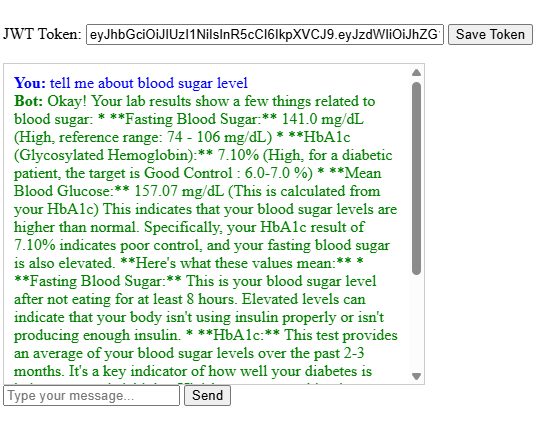
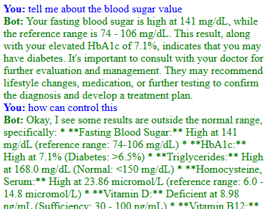

# Drone Operations Coordinator — AI Agent

<div align="center">

**An intelligent, conversational operations management system for drone enterprises**

[](https://python.org)
[](https://fastapi.tiangolo.com)
[](https://langchain.com)
[](https://openai.com)
[](LICENSE)
[](Dockerfile)

</div>

---

## Overview

The **Drone Operations Coordinator** is a production-ready AI-powered management system built for **Skylark Drones**. It replaces manual spreadsheet workflows with a natural-language chat interface backed by a robust REST API. Operations staff can query pilot availability, match drones to missions, detect scheduling conflicts, and manage assignments — all through conversation.

The system is built on **FastAPI** + **LangChain** with **GPT-4o-mini** as the reasoning engine, and supports both local CSV storage and live **Google Sheets** synchronization.

---

## Screenshots

<table>
  <tr>
    <td align="center"><strong>Chat Interface — Conversational Queries</strong></td>
    <td align="center"><strong>Real-time AI Responses with Structured Data</strong></td>
  </tr>
  <tr>
    <td></td>
    <td></td>
  </tr>
</table>

---

## Features

### Pilot Roster Management
- Query pilots by **skill**, **certification**, and **location**
- View real-time **availability** and current assignments
- Calculate **total mission cost** per pilot (daily rate × mission duration)
- Update pilot status (`Available` / `Assigned` / `On Leave` / `Unavailable`) — syncs to Google Sheets instantly

### Smart Mission Assignment
- Automatically **match pilots to missions** based on required skills, certifications, location, and budget
- Automatically **match drones to missions** based on capabilities, location, and weather conditions
- Track all active, upcoming, and urgent assignments
- Handle **urgent reassignments** with guided step-by-step conflict resolution

### Drone Fleet Inventory
- Query the entire fleet by **capability** (RGB, LiDAR, Thermal), **location**, or **weather resistance**
- Filter drones by weather compatibility — `IP43` rating for rainy conditions
- Track **deployment status** and upcoming maintenance schedules
- Status updates sync live to Google Sheets

### Conflict Detection Engine
The system proactively detects and reports:

| Conflict Type | Severity | Description |
|---|---|---|
| Double-booking | Error | Pilot or drone assigned to two overlapping missions |
| Skill mismatch | Error | Assigned pilot lacks required skills for the mission |
| Certification mismatch | Error | Assigned pilot lacks required certifications |
| Weather incompatibility | Error | Non-waterproof drone assigned to a rainy mission |
| Availability conflict | Error | Pilot not yet available when mission starts |
| Budget overrun | Warning | Pilot cost exceeds mission budget |
| Location mismatch | Warning | Pilot or drone is in a different city than the mission |
| Equipment-pilot mismatch | Warning | Pilot and drone are in different locations |
| Maintenance overlap | Warning | Drone maintenance falls during mission dates |
| Upcoming maintenance | Info | Drone maintenance due within 7 days |
| Extended leave | Info | Pilot on leave for more than 7 days |

---

## Architecture

```
┌──────────────────────────────────────────────────────────┐
│                  Frontend (HTML / CSS / JS)               │
│              Single-page Conversational Chat UI           │
└────────────────────────┬─────────────────────────────────┘
                         │  HTTP
                         ▼
┌──────────────────────────────────────────────────────────┐
│                    FastAPI Backend                        │
│                                                          │
│  ┌───────────────┐  ┌────────────────┐  ┌─────────────┐  │
│  │   REST API    │  │   AI Agent     │  │  Conflict   │  │
│  │  (20+ routes) │  │  (LangChain +  │  │  Detector   │  │
│  │               │  │  GPT-4o-mini)  │  │             │  │
│  └──────┬────────┘  └───────┬────────┘  └──────┬──────┘  │
│         └───────────────────┼──────────────────┘         │
│                             ▼                            │
│              ┌──────────────────────────┐                │
│              │       Data Manager       │                │
│              │  (CSV + Google Sheets)   │                │
│              └──────────────────────────┘                │
└──────────────────────────────────────────────────────────┘
                         │
          ┌──────────────┼──────────────┐
          ▼              ▼              ▼
     ┌─────────┐   ┌──────────┐   ┌─────────┐
     │  CSV    │   │  Google  │   │  OpenAI │
     │  Files  │   │  Sheets  │   │   API   │
     └─────────┘   └──────────┘   └─────────┘
```

---

## Project Structure

```
drone-operations-coordinator/
│
├── backend/
│   ├── main.py              # FastAPI app — all REST endpoints
│   ├── agent.py             # LangChain AI agent + 20 custom tools
│   ├── conflict_detector.py # Full conflict validation engine
│   ├── data_manager.py      # CSV + Google Sheets data layer
│   ├── models.py            # Pydantic models for all entities
│   └── __init__.py
│
├── frontend/
│   └── index.html           # Single-page chat UI (vanilla JS)
│
├── data/
│   ├── pilot_roster.csv     # Pilot data (skills, certs, rates, status)
│   ├── drone_fleet.csv      # Drone inventory (capabilities, maintenance)
│   └── missions.csv         # Mission data (requirements, budgets, dates)
│
├── assets/
│   ├── screenshot1.png      # App screenshot — chat demo
│   └── screenshot2.png      # App screenshot — AI response demo
│
├── Dockerfile
├── requirements.txt
├── .replit
└── README.md
```

### Key Module Descriptions

| File | Responsibility |
|---|---|
| `backend/main.py` | FastAPI application, CORS, static file serving, 20+ API endpoints |
| `backend/agent.py` | LangChain `AgentExecutor` with 20 custom `StructuredTool`s, GPT-4o-mini, `ConversationBufferMemory` |
| `backend/conflict_detector.py` | Validates assignments; detects 10+ conflict types across pilots, drones, and missions |
| `backend/data_manager.py` | Abstracts CSV and Google Sheets reads/writes; handles filtering and suitability matching |
| `backend/models.py` | Pydantic `BaseModel` definitions: `Pilot`, `Drone`, `Mission`, `ConflictWarning`, request/response schemas |
| `frontend/index.html` | Dark-sidebar chat UI; suggestion chips; markdown/bold/emoji rendering; typing animation |

---

## Tech Stack

| Layer | Technology |
|---|---|
| Web Framework | FastAPI 0.109 |
| AI / LLM | LangChain 0.1.4 + OpenAI GPT-4o-mini |
| Data Models | Pydantic v2 |
| ASGI Server | Uvicorn |
| Data Storage | CSV files (default) / Google Sheets (optional) |
| Google Integration | gspread + google-auth |
| Frontend | Vanilla HTML / CSS / JavaScript |
| Containerization | Docker |
| Hosting | Replit / Railway / Render |

---

## Quick Start

### Prerequisites

- Python 3.10+
- An OpenAI API key ([get one here](https://platform.openai.com/api-keys))
- *(Optional)* Google Cloud service account for Google Sheets sync

### 1. Clone the Repository

```bash
git clone https://github.com/abhi29032004/drone-operations-coordinator.git
cd drone-operations-coordinator
```

### 2. Create and Activate a Virtual Environment

```bash
# Create
python -m venv venv

# Activate — macOS / Linux
source venv/bin/activate

# Activate — Windows
.\venv\Scripts\activate
```

### 3. Install Dependencies

```bash
pip install -r requirements.txt
```

### 4. Configure Environment Variables

Create a `.env` file in the project root:

```env
# Required
OPENAI_API_KEY=sk-...

# Optional — Google Sheets integration
USE_GOOGLE_SHEETS=false
GOOGLE_SPREADSHEET_ID=
GOOGLE_CREDENTIALS_PATH=path/to/credentials.json
# OR (for cloud deployment):
GOOGLE_CREDENTIALS_JSON={"type":"service_account",...}

# Optional — override data directory
DATA_DIR=data
```

### 5. Start the Server

```bash
cd backend
python main.py
```

### 6. Open the Application

Navigate to **[http://localhost:8000](http://localhost:8000)** — the chat UI loads automatically.

The interactive API documentation is available at **[http://localhost:8000/docs](http://localhost:8000/docs)**.

---

## API Reference

### Chat

| Method | Endpoint | Description |
|---|---|---|
| `POST` | `/api/chat` | Send a natural-language message to the AI agent |

**Request body:**
```json
{ "message": "Find available pilots in Bangalore" }
```

**Response:**
```json
{ "response": "Here are the available pilots in Bangalore: ..." }
```

---

### Pilots

| Method | Endpoint | Description |
|---|---|---|
| `GET` | `/api/pilots` | List all pilots; filter by `skill`, `certification`, `location`, `status` |
| `GET` | `/api/pilots/{id}` | Get a specific pilot by ID |
| `PUT` | `/api/pilots/{id}/status` | Update pilot status (syncs to Google Sheets) |
| `GET` | `/api/pilots/{id}/cost/{mission_id}` | Calculate total pilot cost for a mission |

---

### Drones

| Method | Endpoint | Description |
|---|---|---|
| `GET` | `/api/drones` | List all drones; filter by `capability`, `location`, `status`, `weather` |
| `GET` | `/api/drones/{id}` | Get a specific drone by ID |
| `PUT` | `/api/drones/{id}/status` | Update drone status (syncs to Google Sheets) |
| `GET` | `/api/drones/maintenance/upcoming` | List drones with maintenance due within `days` (default: 7) |

---

### Missions

| Method | Endpoint | Description |
|---|---|---|
| `GET` | `/api/missions` | List all missions; filter by `priority`, `location` |
| `GET` | `/api/missions/{id}` | Get a specific mission by ID |
| `GET` | `/api/missions/{id}/suitable-pilots` | Get ranked suitable pilots for a mission |
| `GET` | `/api/missions/{id}/suitable-drones` | Get ranked suitable drones for a mission |

---

### Assignments

| Method | Endpoint | Description |
|---|---|---|
| `POST` | `/api/assignments` | Assign a pilot and/or drone to a mission (validates conflicts first) |
| `DELETE` | `/api/assignments/{mission_id}` | Remove an assignment from a mission |

---

### Conflicts & Utilities

| Method | Endpoint | Description |
|---|---|---|
| `GET` | `/api/conflicts` | Run full conflict check across all missions |
| `POST` | `/api/conflicts/validate` | Validate a potential assignment without saving it |
| `GET` | `/api/summary` | Get fleet and operations summary counts |
| `POST` | `/api/refresh` | Reload data from Google Sheets |
| `GET` | `/health` | System health check |

---

## Data Schema

### Pilot Roster (`data/pilot_roster.csv`)

| Field | Type | Example |
|---|---|---|
| `pilot_id` | string | `P001` |
| `name` | string | `Arjun Sharma` |
| `skills` | comma-separated | `Mapping, Survey, Inspection` |
| `certifications` | comma-separated | `DGCA, Night Ops` |
| `location` | string | `Bangalore` |
| `status` | enum | `Available` / `Assigned` / `On Leave` / `Unavailable` |
| `current_assignment` | string | `PRJ003` (or `-` if none) |
| `available_from` | ISO date | `2025-06-01` |
| `daily_rate_inr` | integer | `8000` |

### Drone Fleet (`data/drone_fleet.csv`)

| Field | Type | Example |
|---|---|---|
| `drone_id` | string | `D001` |
| `model` | string | `DJI Matrice 300` |
| `capabilities` | comma-separated | `RGB, LiDAR, Thermal` |
| `status` | enum | `Available` / `Deployed` / `Maintenance` |
| `location` | string | `Mumbai` |
| `current_assignment` | string | `PRJ002` (or `-` if none) |
| `maintenance_due` | ISO date | `2025-07-15` |
| `weather_resistance` | string | `IP43` / `Clear Sky Only` |

### Missions (`data/missions.csv`)

| Field | Type | Example |
|---|---|---|
| `project_id` | string | `PRJ001` |
| `client` | string | `NHAI` |
| `location` | string | `Chennai` |
| `required_skills` | comma-separated | `Mapping, Survey` |
| `required_certs` | comma-separated | `DGCA` |
| `start_date` | ISO date | `2025-06-10` |
| `end_date` | ISO date | `2025-06-20` |
| `priority` | enum | `Urgent` / `High` / `Standard` |
| `mission_budget_inr` | integer | `80000` |
| `weather_forecast` | string | `Sunny` / `Cloudy` / `Rainy` |
| `assigned_pilot` | string | `P003` (or empty) |
| `assigned_drone` | string | `D002` (or empty) |

---

## Example Conversations

```
User:  "Which pilots are available in Bangalore?"
Agent: Lists all pilots with Available status in Bangalore with their skills and daily rates.

User:  "Find suitable pilots for PRJ001"
Agent: Analyses mission requirements, compares against all pilots, returns a ranked
       list with location match, skill match, certification match, budget fit, and
       availability check for each candidate.

User:  "Assign pilot P001 and drone D003 to PRJ001"
Agent: Runs conflict validation → detects budget overrun warning → confirms
       assignment is otherwise valid → saves assignment and reports back.

User:  "What conflicts exist right now?"
Agent: Runs full system check → reports errors (double-bookings, mismatches),
       warnings (budget overruns, location gaps), and info (upcoming maintenance).

User:  "Urgent reassignment — pilot P002 is sick, find a replacement for PRJ003"
Agent: Unassigns P002 → runs find_suitable_pilots_for_mission → validates new
       candidate → reassigns → syncs to Google Sheets → confirms all actions taken.

User:  "Which drones can fly in rainy weather?"
Agent: Filters fleet for IP43-rated drones → returns only Available units.

User:  "Calculate the cost for pilot P004 on PRJ002"
Agent: Fetches pilot daily rate and mission duration → computes total → compares
       against mission budget → reports result with over/under budget status.
```

---

## Google Sheets Integration

### Setup

1. **Create a Google Cloud Project** at [console.cloud.google.com](https://console.cloud.google.com)
2. **Enable the Google Sheets API** under *APIs & Services → Library*
3. **Create a Service Account** under *APIs & Services → Credentials*, then download the JSON key
4. **Prepare your Spreadsheet**
   - Create three sheets named exactly: `pilot_roster`, `drone_fleet`, `missions`
   - Copy headers from the matching CSV files in `data/`
   - Share the spreadsheet with the service account email (found in the JSON key)
5. **Set environment variables:**

```env
USE_GOOGLE_SHEETS=true
GOOGLE_SPREADSHEET_ID=1BxiMVs0XRA5nFMdKvBdBZjgmUUqptlbs74OgVE2upms
GOOGLE_CREDENTIALS_PATH=/path/to/credentials.json
```

When enabled, every status update made through the API or chat immediately writes back to Google Sheets.

---

## Docker Deployment

### Build and Run Locally

```bash
docker build -t drone-ops-coordinator .
docker run -p 8000:8000 \
  -e OPENAI_API_KEY=sk-... \
  -e DATA_DIR=/app/data \
  drone-ops-coordinator
```

### Deploy to Railway

1. Push the repository to GitHub
2. Connect the repo in the Railway dashboard
3. Add environment variables (`OPENAI_API_KEY`, etc.)
4. Railway auto-detects the `Dockerfile` and deploys

### Deploy to Render

1. Create a new **Web Service** in Render
2. Connect your GitHub repository
3. Set the **Start Command**: `cd backend && python main.py`
4. Add environment variables

### Deploy to Replit

1. Import the repository into Replit
2. Add secrets via the **Secrets** panel (`OPENAI_API_KEY`, etc.)
3. Run — the `.replit` config handles the rest

---

## Testing

```bash
# Health check
curl http://localhost:8000/health

# Send a chat message
curl -X POST http://localhost:8000/api/chat \
  -H "Content-Type: application/json" \
  -d '{"message": "Show me all available pilots"}'

# Get all pilots
curl http://localhost:8000/api/pilots

# Get pilots in Bangalore with mapping skill
curl "http://localhost:8000/api/pilots?skill=Mapping&location=Bangalore"

# Check system conflicts
curl http://localhost:8000/api/conflicts

# Create an assignment
curl -X POST http://localhost:8000/api/assignments \
  -H "Content-Type: application/json" \
  -d '{"mission_id": "PRJ001", "pilot_id": "P001", "drone_id": "D001"}'
```

---

## License

This project is licensed under the **MIT License** — see [LICENSE](LICENSE) for full details.

---

<div align="center">

Built with dedication for **Skylark Drones**

</div>
